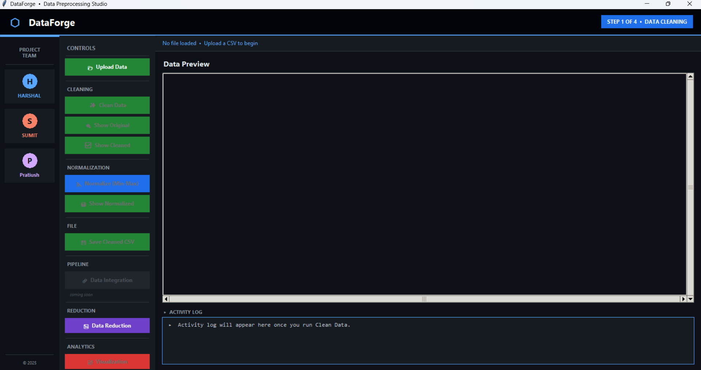
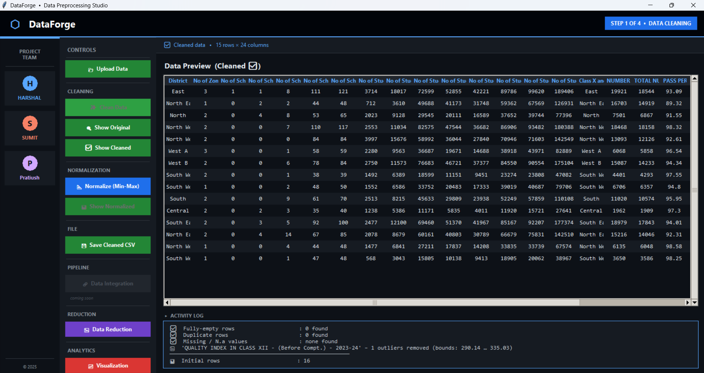
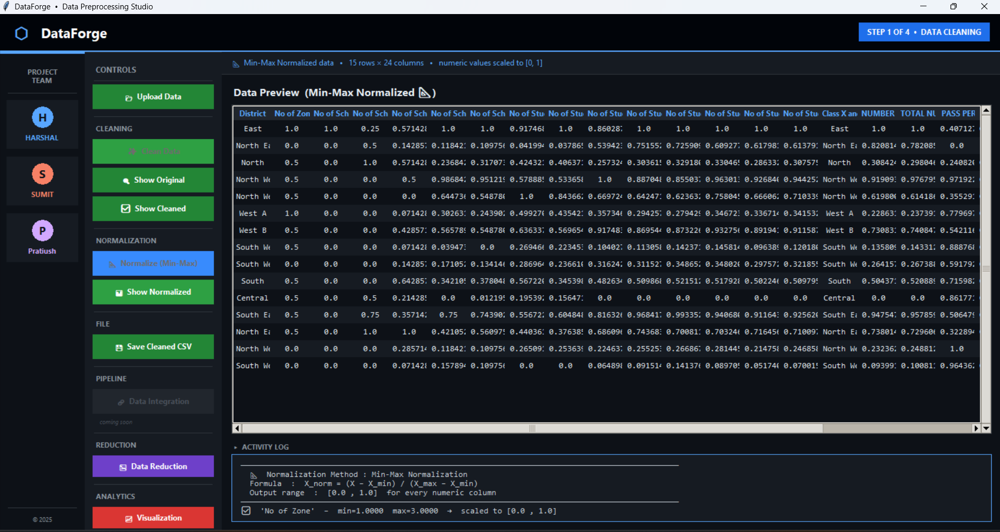
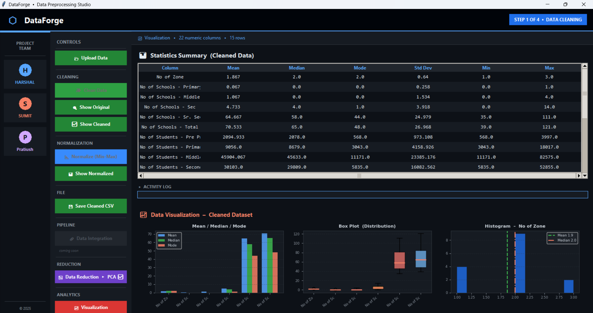
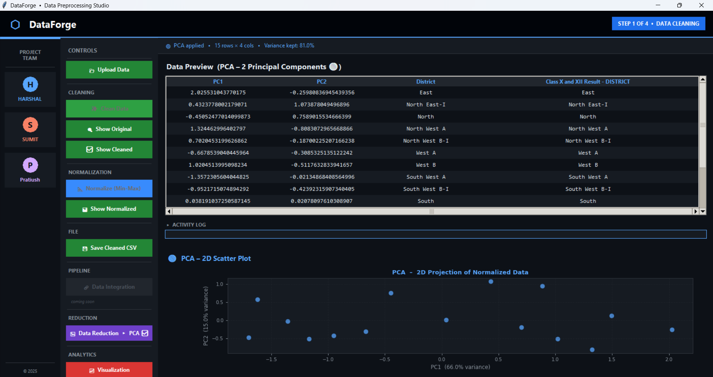

# 📊 DataForge — Data Preprocessing Studio

<p align="center">
  
  
  
  
  
  
  
  
</p>

---

## 🚀 Overview

**DataForge** is a modern desktop-based application designed to simplify **data preprocessing, transformation, analysis, and visualization**.

Built with Python, it transforms complex data workflows into an **interactive GUI pipeline**, making it ideal for students, beginners, and developers working with datasets.

---

## 🖥️ UI Preview

### 🔹 Main Dashboard


### 🔹 Data Cleaning


### 🔹 Normalization


### 🔹 Visualization


### 🔹 Data Reduction (PCA / LDA)


---

## ✨ Features

### 🧹 Data Cleaning Pipeline
- Detects and replaces null-like values (`N/A`, `null`, `-`, etc.)
- Removes empty rows and duplicate entries
- Converts numeric-like strings into numeric format
- Handles missing values:
  - Median for numerical columns
  - Mode / `"Unknown"` for categorical columns
- Removes outliers using **IQR (Interquartile Range)**

---

### 📐 Data Transformation
- Min-Max Normalization
- Scales numeric data to `[0,1]`
- Handles constant columns safely

---

### 📉 Data Reduction
- **PCA (Principal Component Analysis)**
- **LDA (Linear Discriminant Analysis)**

---

### 📈 Data Visualization
- Statistical summary:
  - Mean, Median, Mode, Std Dev
- Charts:
  - Bar graph
  - Box plot
  - Histogram
- Embedded visualization inside GUI

---

### 📂 File Handling
- Upload CSV datasets
- Preview original, cleaned, and normalized data
- Export cleaned dataset

---

## 🔄 Workflow

```text
Upload Data → Clean Data → Normalize → Reduce → Visualize → Export

